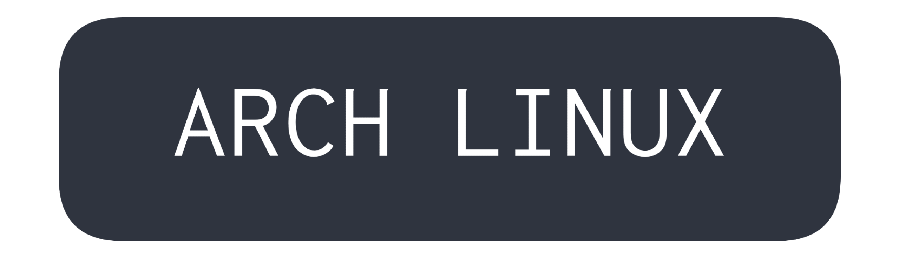
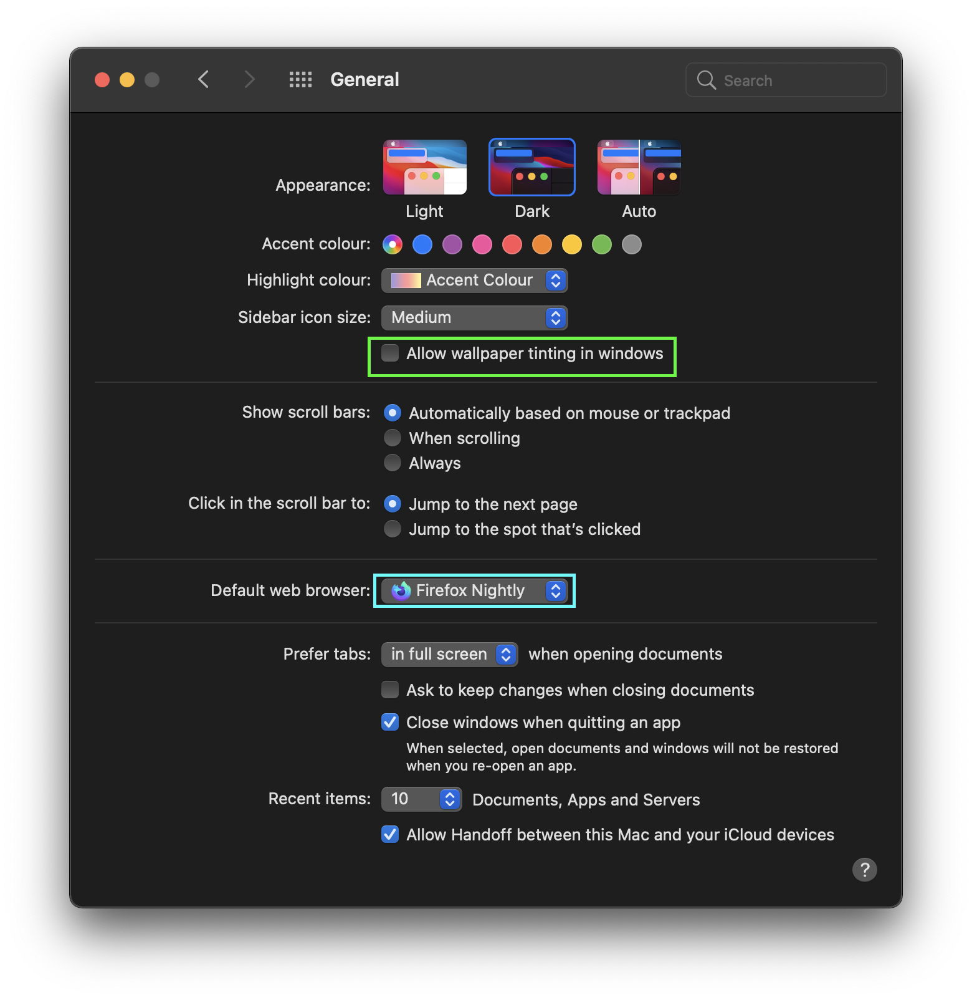
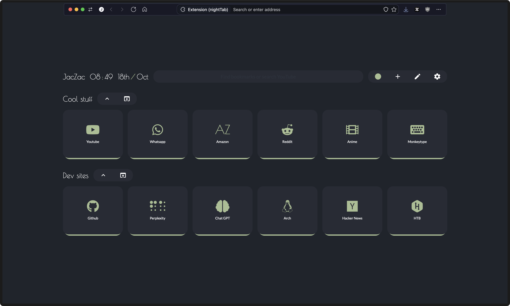
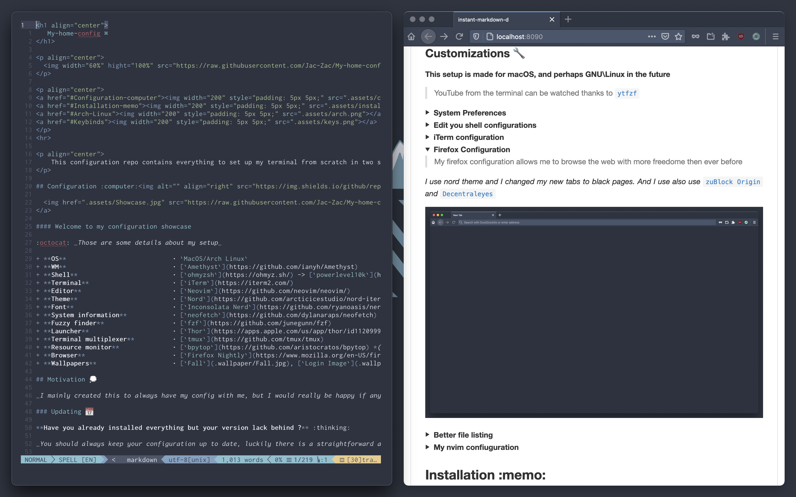

<h1 align="center">
   My-home-config ⌘
</h1>

<p align="center">
  
</p>

<p align="center">
<a href="#Configuration-computer"></a>
<a href="#Installation-memo"></a>
<a href="#Arch-Linux"></a>
<a href="#Keybinds"></a>
</p>
<hr>

<p align="center">
	This configuration repo contains everything to set up my terminal from scratch in two scripts. It also has a very easy way to update your old configuration to keep it up to date.
</p>

## Configuration :computer:

  
</a>

#### Welcome to my configuration showcase

:octocat: _Those are some details about my setup_

- **OS** • `MacOS/Arch Linux`
- **WM** • [`yabai`](https://github.com/asmvik/yabai) + [`skhd`](https://github.com/asmvik/skhd)
- **Bar** • [`SketchyBar`](https://github.com/FelixKratz/SketchyBar) + [`JankyBorders`](https://github.com/FelixKratz/JankyBorders)
- **Shell** • [`zsh`](https://www.zsh.org/) -> [`powerlevel10k`](https://github.com/romkatv/powerlevel10k)
- **Terminal** • [`Ghostty`](https://github.com/ghostty-org/ghostty)
- **Fuzzy Finder** • [`Television`](https://github.com/alexpasmantier/television)
- **Session Manager** • [`sesh`](https://github.com/joshmedeski/sesh) + [`tmux`](https://github.com/tmux/tmux)
- **Editor** • [`Neovim`](https://github.com/neovim/neovim/) / [`Zed`](https://zed.dev)
- **AI tools** • [`Claude Code`](https://claude.com/claude-code) / [`opencode`](https://opencode.ai)
- **Theme** • [`Nord`](https://github.com/arcticicestudio/nord-iterm2)
- **Font** • [`Inconsolata Nerd`](https://github.com/ryanoasis/nerd-fonts)
- **System information** • [`fastfetch`](https://github.com/fastfetch-cli/fastfetch)
- **Launcher** • [`Raycast`](https://www.raycast.com/)
- **Browser** • [`Helium`](https://github.com/imputnet/helium)
- **Wallpapers** • [`Southern Live Oak`](https://www.unitus.it/wp-content/uploads/2024/09/pexels-veeterzy-38136-scaled.jpg)

## Motivation 💭

_I mainly created this to always have my config with me, but I would really be happy if anybody wanted to try it. Furthermore I think that if I can help someone with this it is worth sharing it._

### Updating :calendar:

**Have you already installed everything but your version lags behind?** :thinking:

_You should always keep your configuration up to date, luckily there is a straightforward and noob-proof solution._

<details>
<summary><strong>Instruction to update</strong></summary>

> If you wish to update your current configuration to the latest updates you can just follow the simple instructions that follows.

- You have to go to the "My-home-config" directory

  cd My-home-config

- Pull the updates from Github latest version

  git pull

- This command run the install script in update mode

  ./installer.sh -u

</details>

### Customizations 🔧

##### This setup is made for macOS (with a minimal Arch Linux setup as well)

<details>
	<summary><strong>System Preferences</strong></summary>

> I'd like to load all of those preferences automatically with the default command in the future

- I also suggest to Automatically Hide & Show the Menu Bar and also set show scroll bar in all the application only when scrolling (system Preferences -> General)
- Absolutely disable wallpaper tinting in windows inside system preferences > general on macOS Big Sur
<!-- - Enable Reduce Motion (System Settings -> Accessibility -> Motion). It swaps the space-switch slide for a fast fade, which feels instant with yabai tiling and lowers WindowServer work. Note: yabai itself doesn't require it — the fast path is the scripting addition (`sudo yabai --load-sa`); keep `skip_window_focus_animation` off while SA loads. Applied automatically by `installer.sh -p`. -->



</details>

<details>
	<summary><strong>Edit your shell configurations</strong></summary>

> Shell configurations

_If you want you can go to [`~/.config/zsh`](.config/zsh) to edit your [`.zshrc`](.config/zsh/.zshrc) and you can uncomment lines._
_You can also edit your prompt in the [`~/.config/zsh/.p10k.zsh`](.config/zsh/.p10k.zsh)_


</details>

<details>
	<summary><strong>Television + sesh</strong></summary>

> I use [`Television`](https://github.com/alexpasmantier/television) as my fuzzy finder with the [`sesh`](https://github.com/joshmedeski/sesh) channel for session management.

- Press `prefix + s` in tmux to open the sesh session picker
- Press `prefix + t` to jump between windows of the current session (custom `tmux-session-windows` channel)
- Press `prefix + S` to pick an ssh host and open it in a new window
- Television also provides shell integration with `Ctrl+T` for file picking and `Ctrl+R` for history

### Recommended Configuration

```bash
# Install Television
brew install television

# Install sesh
brew install sesh

# Update channels for latest community integrations
tv update-channels
```

</details>

<details>
	<summary><strong>Helium Browser</strong></summary>

> [`Helium`](https://github.com/imputnet/helium) is a privacy-first, fast Chromium-based browser and my main browser (<kbd>command + 0</kbd>). Furthermore use 1.1.1.1 as your DNS Server

- Privacy-focused with uBlock Origin built in
- No bloat or unnecessary features
- Available at [helium.computer](https://helium.computer/) or with `brew install --cask helium-browser`

### Extensions I suggest

- I suggest the [0xMH YouTube Shorts blocker](https://github.com/0xMH/ublock-youtube-shorts) filter list for uBlock to hide Shorts.
- [`SponsorBlock`](https://sponsor.ajay.app/)
- [`Vimium`](https://github.com/philc/vimium) with custom [nord theme](https://github.com/Foldex/vimium-dark-themes/tree/master)
- [`Stylus`](https://github.com/openstyles/stylus) with [nord theme for youtube](https://github.com/MajesticWaffle/Youtube-Nord-Theme) and this for [whatsapp](https://github.com/vednoc/dark-whatsapp)

</details>

<details>
	<summary><strong>Zen Browser (secondary)</strong></summary>

> I still keep [`Zen`](https://www.zen-browser.app/) around as a Firefox-based alternative. I run it in compact mode with these keybindings:

| Command | Description |
| ------- | ----------- |
| Cmd - S | Sidebar     |
| Cmd - B | Topbar      |



</details>

<details>
	<summary><strong>My nvim configuration</strong></summary>



My Neovim config lives in its own repo: [`astronvim_jaczac`](https://github.com/Jac-Zac/astronvim_jaczac), built on top of [AstroNvim](https://github.com/AstroNvim/AstroNvim). The installer clones it with `./installer.sh -n`.

</details>

<details>
	<summary><strong>Zed</strong></summary>

> I also use [`Zed`](https://zed.dev) with vim mode, mostly for remote development over ssh and notebooks. The config is in [`.config/zed`](.config/zed) (settings, keymap and a task to preview Typst documents).

</details>

<details>
	<summary><strong>SketchyBar</strong></summary>

> My [`SketchyBar`](https://github.com/FelixKratz/SketchyBar) config is written in Lua ([`.config/sketchybar`](.config/sketchybar)) and shows spaces, the front app, battery, volume, wifi, keyboard layout, a calendar and AI agent usage.

</details>

## Installation :memo:

> You have to be in zsh shell for this installation, if you are running an old version of macOS you might need to switch away from bash

#### Step by step instructions

1. This is to clone the repository without old commits, and enter inside it ⏳

```bash
git clone https://github.com/Jac-Zac/My-home-config.git --depth=1 && cd My-home-config
```

2. This command give execute permission to the script

```bash
chmod +x installer.sh
```

3. Run the script. If you want to get some more information you can start by running `./installer -h`

```bash
./installer.sh
```

> You should close your terminal windows and open a new one, to reload the configurations

_Run `./installer.sh -r` on a machine that already has the packages to only restore the configuration (shell, tmux, yabai, sketchybar...)_

**Installation Completed !**

## Maintenance :gear:

#### Routines you should implement into your mac usage

_You should try to keep your system up to date, also follow the [`instruction under the updating section`](#Updating-calendar)_

###### And I also use:

- [`mole`](https://github.com/tw93/Mole) to clean up any junk that has built up.
- [`ncdu`](https://github.com/rofl0r/ncdu) / [`gdu`](https://github.com/dundee/gdu) to check for big files and directory that I can delete
- [`upterm`](https://upterm.dev/) for instant terminal sharing and pair programming
- [`sesh`](https://github.com/joshmedeski/sesh) to improve my tmux experience
- [`Television`](https://github.com/alexpasmantier/television) a fast, fuzzy picker for everything (including history with `Ctrl-r`)
- [`lazygit`](https://github.com/jesseduffield/lazygit) for git (`prefix + g` opens it in a tmux popup)

## Keybinds

I use <kbd>command</kbd> AKA super key (on GNU/Linux) as my main modifier

#### Keyboard ⌨️

| Keybind                                 | Action                              |
| --------------------------------------- | ----------------------------------- |
| <kbd>command + shift + enter</kbd>      | Spawn terminal (Ghostty)            |
| <kbd>command + 0</kbd>                  | Open browser (Helium)               |
| <kbd>command + m</kbd>                  | Open WhatsApp                       |
| <kbd>command + g</kbd>                  | Open ChatGPT                        |
| <kbd>command + space</kbd>              | Launch Raycast                      |
| <kbd>command + w</kbd>                  | Close Window                        |
| <kbd>command + q</kbd>                  | Close Application                   |
| <kbd>command + [1-9]</kbd>              | Change workspace                    |
| <kbd>command + [j/k]</kbd>              | Previous / next workspace           |
| <kbd>command + [h/l]</kbd>              | Focus window west / east            |
| <kbd>command + shift + [1-9]</kbd>      | Move focused window to workspace    |
| <kbd>command + shift + [j/k]</kbd>      | Move window to prev / next space    |
| <kbd>command + shift + [h/l]</kbd>      | Cycle windows (counter)clockwise    |
| <kbd>command + shift + f</kbd>          | Toggle float layout                 |
| <kbd>command + shift + space</kbd>      | Toggle bsp layout                   |
| <kbd>command + shift + t</kbd>          | Float window in the center (and back) |
| <kbd>lctrl + alt + cmd + q</kbd>        | Restart yabai, skhd, borders, bar   |

#### tmux (prefix is <kbd>Ctrl + a</kbd>)

| Keybind                  | Action                         |
| ------------------------ | ------------------------------ |
| <kbd>prefix + s</kbd>    | Sesh session picker (tv)       |
| <kbd>prefix + t</kbd>    | Window picker (tv)             |
| <kbd>prefix + S</kbd>    | SSH host picker (tv)           |
| <kbd>prefix + L</kbd>    | Last sesh session              |
| <kbd>prefix + g</kbd>    | lazygit popup                  |
| <kbd>prefix + [j/k]</kbd> | Next / previous window        |
| <kbd>Ctrl + t</kbd>      | Shell autocomplete (tv)        |
| <kbd>Ctrl + r</kbd>      | Shell history (tv)             |

## Other things 📚

For the README.md I took inspiration from [this repo](https://github.com/owl4ce/dotfiles), and for the bootstrap script I took inspiration from [this repo instead](https://github.com/natelandau/dotfiles).
I also have many aliases ([`.config/aliases/aliasrc`](.config/aliases/aliasrc)), for example if you write `intel` in front of any command it will run under Rosetta, and `ngshare <port>` exposes a local port through ngrok.

<h2 align="center">
<hr>
	Arch Linux
</h2>

<em><p align="center">This is what a little showcase</p></em>


<em><p align="center">
Now I also have a configuration for my Raspberry pi 4 running Arch with [dwm](https://dwm.suckless.org/) as a WM and I'm loving it so far, thus I'm thinking of posting that too in the future.
I think I will do it if some asks for it

</p></em>

---

### Problems ❌

If you happen to run into some problems you can just open an issue, I'll try to solve it as soon as possible. Otherwise you can contact me by sending me an email.

> It is not been tested for a bit. Therefore feedback are appreciated

