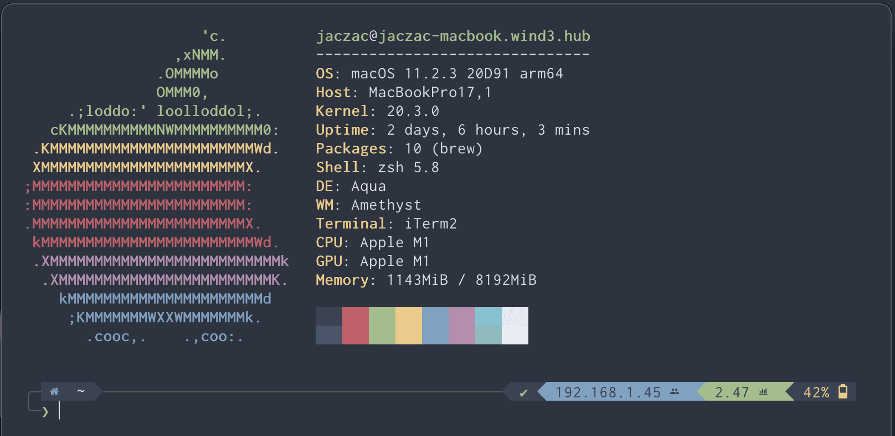

<h1 align="center">
   My-home-config ⌘
</h1>

<p align="center">
  
</p>

<p align="center">
<a href="#Configuration-computer"></a>
<a href="#Installation-memo"></a>
<a href="#Arch-Linux"></a>
<a href="#Keybinds"></a>
</p>
<hr>

<p align="center">
	This configuration repo contains everything to set up my terminal from scratch in two scripts. It also has a very easy way to update your old configuration to keep it up to date.
</p>

## Configuration :computer:

  
</a>

#### Welcome to my configuration showcase

:octocat: _Those are some details about my setup_

+ **OS**							• `MacOS/Arch Linux` 
+ **WM**							• [`yabai`](https://github.com/koekeishiya/yabai)
+ **Shell**							• [`zsh`](https://www.zsh.org/) -> [`powerlevel10k`](https://github.com/romkatv/powerlevel10k)
+ **Terminal**						• [`iTerm`](https://iterm2.com/) 
+ **Editor**						• [`Neovim`](https://github.com/neovim/neovim/) 
+ **Theme**							• [`Nord`](https://github.com/arcticicestudio/nord-iterm2)
+ **Font**							• [`Inconsolata Nerd`](https://github.com/ryanoasis/nerd-fonts)
+ **System information**			• [`neofetch`](https://github.com/dylanaraps/neofetch)
+ **Fuzzy finder**					• [`fzf`](https://github.com/junegunn/fzf) 
+ **Launcher**						• [`skhd`](https://github.com/koekeishiya/skhd) and [`Alfred`](https://www.alfredapp.com)
+ **Terminal multiplexer**			• [`tmux`](https://github.com/tmux/tmux)
+ **Resource monitor**				• [`bpytop`](https://github.com/aristocratos/bpytop) *(aliased to top)*
+ **Browser**						• [`Firefox Nightly`](https://www.mozilla.org/en-US/firefox/61.0a1/releasenotes/)
+ **Wallpapers**					• [`Fall`](.wallpaper/Fall.jpg), [`Login Image`](.wallpaper/gruv-staircase.jpg)

## Motivation 💭

_I mainly created this to always have my config with me, but I would really be happy if anybody wanted to try it. Furthermore I think that if I can help someone with this it is worth sharing it._

### Install only brew 🍺

*If you only need brew you can install it on your system whether it is x86_64 or arm just run this one-liner*

```bash
curl -SL https://raw.githubusercontent.com/Jac-Zac/My-home-config/master/installer.sh >> installer.sh ; chmod +x installer.sh; ./installer.sh -b; rm installer.sh
```

### Updating :calendar:

**Have you already installed everything but your version lack behind ?** :thinking:

_You should always keep your configuration up to date, luckily there is a straightforward and noob-proof solution._

<details>
<summary><strong>Instruction to update</strong></summary>

> If you wish to update your current configuration to the latest updates you can just follow the simple instructions that follows.

- You have to go to the "My-home-config" directory
		 
	  cd My-home-config

- Pull the updates from Github latest version  

	  git pull

- This command run the install script in update mode

	  ./installer.sh -u

</details>

### Customizations 🔧

##### This setup is made for macOS, and perhaps GNU\Linux in the future
> YouTube from the terminal can be watched thanks to [`ytfzf`](https://github.com/pystardust/ytfzf)

<details>
	<summary><strong>System Preferences</strong></summary>

> I'd like to load all of those preferences automatically with the default command in the future

- I also suggest to Automatically Hide & Show the Menu Bar and also set show scroll bar in all the application only when scrolling (system Preferences -> General)
- Absolutely disable wallpaper tinting in windows inside system preferences > general on macOS Big Sur 


</details>

<details>
	<summary><strong>Edit you shell configurations</strong></summary>

> Shell configurations

_If you want you can go to [`~/.config/zsh`](.config/zsh) to edit your [`.zshrc`](.config/zsh/.zshrc) and you can uncomment lines._
_You can also edit your prompt in the [`~/.config/zsh/.p10k.zsh`](.config/zsh/.p10k.zsh)_



</details>

<details>
	<summary><strong>iTerm configuration</strong></summary>

> Everything related to my iTerm

**I use iTerm in minimal mode with tab bar on the bottom and borderless setting.**

If you'd like to see images on iTerm you can use [`imgcat`](https://pypi.org/project/imgcat/).


*You can also go to your iTerm preferences and import the iTerm_profile.json that you can find in the cloned directory*

> To have a bit of space I also suggest to add 20px of padding, set it under advanced >  margin

</details>

<details>
	<summary><strong>Firefox Configuration</strong></summary>

> My firefox configuration allows me to browse the web with more freedom then ever before. Furthermore use 1.1.1.1 as your DNS Server

*I use [nord theme](https://addons.mozilla.org/en-US/firefox/addon/nord-theme-cool/?utm_source=addons.mozilla.org&utm_medium=referral&utm_content=search) and I changed my new tabs to black pages.*


- [`zuBlock Origin`](https://ublockorigin.com) 
- [`LocalCDN`](https://www.localcdn.org/)
- [`HTTPS Everywhere`](https://www.eff.org/https-everywhere)
- [`Privacy Badger`](https://privacybadger.org/)
- [`SponsorBlock`](https://sponsor.ajay.app/)
- [`Temp Mail`](https://addons.mozilla.org/en-US/firefox/addon/temp-mail/)
- [`Stylus`](https://addons.mozilla.org/en-US/firefox/addon/styl-us/)

> And use [nord theme for youtube](https://github.com/MajesticWaffle/Youtube-Nord-Theme) and this for [whatsapp](https://github.com/vednoc/dark-whatsapp)

##### Set this value in your [about:config](about:config) to true
```
toolkit.legacyUserProfileCustomizations.stylesheets = true
```
> Then follow [this](https://www.youtube.com/watch?v=1UhsLlJs9Jg) tutorial, and use copy the chrome directory from my file or go to [this Github page](https://github.com/andreasgrafen/ag.proton)


</details>

<details>
	<summary><strong>Better file listing</strong></summary>

> I have aliased ls to [`lsd`](https://github.com/Peltoche/lsd), to make it look better and have icons


*If you are not interested in using it just uncomment the following line in the .zshrc file*

	alias ls="lsd"

</details>

<details>
	<summary><strong>My nvim confiuguration</strong></summary>


> This configurations has a sort of Latex integrated with [`markdown-preview`](https://github.com/instant-markdown/vim-instant-markdown)! 

_I have also added latex compiling on the fly with_ [`neotex`](https://github.com/donRaphaco/neotex), and [`zathura`](https://github.com/zegervdv/homebrew-zathura)

	vim ~/.config/nvim/init.vim

##### And then run the command ``:PlugInstall``

</details>

## Installation :memo:

> You have to be in zsh shell for this installation, if you are running an old version of macOS you might need to switch away from bash

#### Step by step instructions 

1. This is to clone the repository without old commits, and enter inside it ⏳ 

```
git clone https://github.com/Jac-Zac/My-home-config.git --depth=1 && cd My-home-config
```

2. This command give execute permission to the script

```
chmod +x installer.sh 
```

3. Run the script. If you want to get some more information you can start by running `./installer -h`

```
./installer.sh
```
> You should close your terminal windows and open a new one, to reload the configurations

*You can run ```.\install -s``` to only install the command prompt configurations*

**Installation Completed !**

## Maintenance :gear:

#### Routines you should implement into your mac usage

*You should try to keep your system up to date, also follow the [`instruction under the updating section`](#Updating-calendar)*

###### And I also use: 

- [`this`](https://github.com/mengfeng/clean-my-mac) script to clean up any junk that has build up.
- [`ncdu`](https://github.com/rofl0r/ncdu) to check for big files and directory that I can delete

#### Checking for malware 

Moreover it is always a good measure to check if you have any malware installed by using [`clamav`](https://github.com/Cisco-Talos/clamav).

###### To use it just run:

```
sudo freshclam
```
> If you get an error try copy the sample configuration file to a new file and comment out `Example` side the file.

###### Wait for it to finish and then:

```
sudo clamscan -r --bell -i /
```

## Keybinds

I use <kbd>command</kbd> AKA super key (on GNU/Linux) as my main modifier

#### Keyboard ⌨️

| Keybind | Action |
| --- | --- |
| <kbd>command + shift + enter</kbd> | Spawn terminal |
| <kbd>command + enter</kbd> | Swap windows |
| <kbd>command + b</kbd> | Open firefox nightly |
| <kbd>command + p</kbd> | Launch Alfred |
| <kbd>command + w</kbd> | Close Window |
| <kbd>command + q</kbd> | Close Application |
| <kbd>cotrol + [1-0]</kbd> | Change workspace |
| <kbd>command + shift + [1-0]</kbd> | Move focused client to workspace |
| <kbd>command + shift + [hjkl]</kbd> | Resize client |
| <kbd>command + [hjkl]</kbd> | Change focus by direction |
| <kbd>alt + f</kbd> | Set window to floating mode |


## Other things 📚

I'd like to slowly switch aways from powerlevel10k to get a faster feeling shell, but now I will be focusing on other things but also better my configuration for M1 Mac. For the README.md I took inspiration from [this repo](https://github.com/owl4ce/dotfiles), and for the bootstrap script I took inspiration from [this repo instead](https://github.com/natelandau/dotfiles).
I have also started using [`Zsh Vi Mode`](https://github.com/jeffreytse/zsh-vi-mode), in my shell prompt.
In conclusion I have started using [expose](https://github.com/beyondcode/expose) instead of ngrok to create secure tunnels, by using the command `expose --auth=my_token`.
I have just added support for other Linux distros at least to have a decent configuration.
I also have many aliases for example if you write `intel` in front of any command it will run the under Rosetta.

    sudo nvram boot-args=-arm64e_preview_abi

Create a certificate and compile yabai to then switch it s
https://www.simple-bar.com/

<h2 align="center">
<hr>
	Arch Linux
</h2>

<em><p align="center">This is what a little showcase</p></em>


<em><p align="center"> 
Now I also have a configuration for my Raspberry pi 4 running Arch with [dwm](https://dwm.suckless.org/) as a WM and I'm loving it so far, thus I'm thinking of posting that too in the future.
I think I will do it if some asks for it
</p></em>

---

### Problems ❌
If you happen to run into some problems you can just open an issue, I'll try to solve it as soon as possible. Otherwise you can contact me by sending me an email. 
> It is not been tested for a bit. Therefore feedbacks are appreciated 
