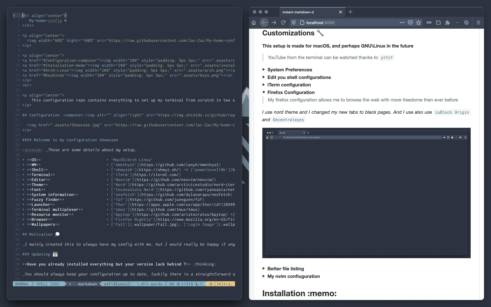

<h1 align="center">
   My-home-config ⌘
</h1>

<p align="center">
  
</p>

<p align="center">
<a href="#Configuration-computer"></a>
<a href="#Installation-memo"></a>
<a href="#Arch-Linux"></a>
<a href="#Keybinds"></a>
</p>
<hr>

<p align="center">
	This configuration repo contains everything to set up my terminal from scratch in two scripts. It also has a very easy way to update your old configuration to keep it up to date.
</p>

## Table of Contents

- [Configuration](#configuration-computer)
- [Motivation](#motivation-)
- [Installation](#installation-memo)
- [Troubleshooting](#troubleshooting)  
- [Maintenance](#maintenance-gear)
- [Keybinds](#keybinds)
- [Arch Linux](#arch-linux)
- [Problems](#problems-)

## Configuration :computer: 

  
</a>

#### Welcome to my configuration showcase

:octocat: _Those are some details about my setup_

- **OS** • `MacOS/Arch Linux`
- **WM** • [`yabai`](https://github.com/koekeishiya/yabai)
- **Shell** • [`zsh`](https://www.zsh.org/) -> [`powerlevel10k`](https://github.com/romkatv/powerlevel10k)
- **Terminal** • [`Ghostty`](https://github.com/ghostty-org/ghostty)
- **Editor** • [`Neovim`](https://github.com/neovim/neovim/)
- **Theme** • [`Nord`](https://github.com/arcticicestudio/nord-iterm2)
- **Font** • [`Inconsolata Nerd`](https://github.com/ryanoasis/nerd-fonts)
- **System information** • [`fastfetch`](https://github.com/fastfetch-cli/fastfetch)
- **Fuzzy finder** • [`fzf`](https://github.com/junegunn/fzf)
- **Launcher** • [`skhd`](https://github.com/koekeishiya/skhd) and [`Raycast`](https://www.raycast.com/)
- **Terminal multiplexer** • [`tmux`](https://github.com/tmux/tmux)
- **Resource monitor** • [`btop`](https://github.com/aristocratos/btop) _(aliased to top)_
- **Browser** • [`Zen Browser`](https://www.zen-browser.app/)
- **Wallpapers** • [`Fall`](https://wallpaper.dog/large/10812699.jpg)

## Motivation 💭

_I mainly created this to always have my config with me, but I would really be happy if anybody wanted to try it. Furthermore I think that if I can help someone with this it is worth sharing it._

### Updating :calendar:

**Have you already installed everything but your version lack behind ?** :thinking:

_You should always keep your configuration up to date, luckily there is a straightforward and noob-proof solution._

<details>
<summary><strong>Instruction to update</strong></summary>

> If you wish to update your current configuration to the latest updates you can just follow the simple instructions that follows.

- You have to go to the "My-home-config" directory

  cd My-home-config

- Pull the updates from Github latest version

  git pull

- This command run the install script in update mode

  ./installer.sh -u

</details>

### Customizations 🔧

##### This setup is made for macOS, and perhaps GNU/Linux in the future

> YouTube from the terminal can be watched thanks to [`ytfzf`](https://github.com/pystardust/ytfzf)

<details>
	<summary><strong>System Preferences</strong></summary>

> I'd like to load all of those preferences automatically with the default command in the future

- I also suggest to Automatically Hide & Show the Menu Bar and also set show scroll bar in all the application only when scrolling (system Preferences -> General)
- Absolutely disable wallpaper tinting in windows inside system preferences > general on macOS Big Sur


</details>

<details>
	<summary><strong>Edit you shell configurations</strong></summary>

> Shell configurations

_If you want you can go to [`~/.config/zsh`](.config/zsh) to edit your [`.zshrc`](.config/zsh/.zshrc) and you can uncomment lines._
_You can also edit your prompt in the [`~/.config/zsh/.p10k.zsh`](.config/zsh/.p10k.zsh)_


</details>

<details>
	<summary><strong>iTerm configuration</strong></summary>

> Everything related to my iTerm

**I use iTerm in minimal mode with tab bar on the bottom and border-less setting.**

If you'd like to see images on iTerm you can use [`imgcat`](https://pypi.org/project/imgcat/).


_You can also go to your iTerm preferences and import the iTerm_profile.json that you can find in the cloned directory_

> To have a bit of space I also suggest to add 20px of padding, set it under advanced > margin

</details>

<details>
	<summary><strong>Zen Configuration</strong></summary>

> My Zen configuration allows me to browse the web with more freedom then ever before. Furthermore use 1.1.1.1 as your DNS Server

I run zen in compact mode and use the following keybindings

### Mappings

| Command | Description |
| ------- | ----------- |
| Cmd - S | Sidebar     |
| Cmd - B | Topbar      |

### A possible good idea is to use:

_I use [nord theme](https://addons.mozilla.org/en-US/firefox/addon/nord-theme-cool/?utm_source=addons.mozilla.org&utm_medium=referral&utm_content=search) and I changed my new tabs to black pages. And I use brave search_

- [`zuBlock Origin`](https://ublockorigin.com)
- [`LocalCDN`](https://www.localcdn.org/)
- [`HTTPS Everywhere`](https://www.eff.org/https-everywhere)
- [`Privacy Badger`](https://privacybadger.org/)
- [`SponsorBlock`](https://sponsor.ajay.app/)
- [`Temp Mail`](https://addons.mozilla.org/en-US/firefox/addon/temp-mail/)
- [`Stylus`](https://addons.mozilla.org/en-US/firefox/addon/styl-us/)
- [`Vimium`](https://addons.mozilla.org/en-US/firefox/addon/vimium-ff/) with custom [nord theme](https://github.com/Foldex/vimium-dark-themes/tree/master)

> And use [nord theme for youtube](https://github.com/MajesticWaffle/Youtube-Nord-Theme) and this for [whatsapp](https://github.com/vednoc/dark-whatsapp)


</details>

<details>
	<summary><strong>My nvim configuration</strong></summary>



Look into https://github.com/AstroNvim/AstroNvim

I use my custom fork of [luavim](https://github.com/elairavi/luavim)

_I have also added latex compiling on the fly with_ [`neotex`](https://github.com/donRaphaco/neotex), and [`zathura`](https://github.com/zegervdv/homebrew-zathura)

</details>

## Installation :memo:

### Prerequisites

Before running the installation script, ensure you have:

- **macOS**: macOS 10.15 (Catalina) or later
- **Linux**: A supported distribution (Arch Linux, Ubuntu, Debian, Fedora, openSUSE)
- **Shell**: `zsh` shell (the script will install and configure it if not present)
- **Internet Connection**: Required for downloading packages and configurations
- **Admin Access**: `sudo` privileges for installing system packages

> You have to be in zsh shell for this installation, if you are running an old version of macOS you might need to switch away from bash

#### Step by step instructions

1. This is to clone the repository without old commits, and enter inside it ⏳

```bash
git clone https://github.com/Jac-Zac/My-home-config.git --depth=1 && cd My-home-config
```

2. This command give execute permission to the script

```bash
chmod +x installer.sh
```

3. Run the script. If you want to get some more information you can start by running `./installer.sh -h`

```bash
./installer.sh
```

> You should close your terminal windows and open a new one, to reload the configurations

_You can run `./installer.sh -s` to only install the command prompt configurations_

**Installation Completed !**

## Troubleshooting

### Common Issues

- **Permission Denied**: Ensure you have `sudo` privileges and the script has execute permissions (`chmod +x installer.sh`)
- **Command Not Found**: Make sure you're in the correct directory with the installer script
- **Network Issues**: Check your internet connection if downloads fail
- **Homebrew Installation Failed (macOS)**: Try installing Homebrew manually first: `/bin/bash -c "$(curl -fsSL https://raw.githubusercontent.com/Homebrew/install/HEAD/install.sh)"`

### Getting Help

If you encounter issues:
1. Check the error message carefully
2. Ensure all prerequisites are met
3. Try running the script with verbose output
4. Open an issue on GitHub with details about your system and the error

## Maintenance :gear:

#### Routines you should implement into your mac usage

_You should try to keep your system up to date, also follow the [`instruction under the updating section`](#Updating-calendar)_

###### And I also use:

- [`this`](https://github.com/mengfeng/clean-my-mac) script to clean up any junk that has build up.
- [`ncdu`](https://github.com/rofl0r/ncdu) to check for big files and directory that I can delete
- [`tmate`](https://tmate.io/) for instant terminal sharing and pair programming
- [`sesh`](https://github.com/joshmedeski/sesh) to improve my tmux experience
- [`atuin`](https://github.com/atuinsh/atuin) better command for history with `ctr-r`

## Keybinds

I use <kbd>command</kbd> AKA super key (on GNU/Linux) as my main modifier

#### Keyboard ⌨️

| Keybind                             | Action                           |
| ----------------------------------- | -------------------------------- |
| <kbd>command + shift + enter</kbd>  | Spawn terminal                   |
| <kbd>command + n</kbd>              | Swap new windows                 |
| <kbd>command + 0</kbd>              | Open Zen Browser                 |
| <kbd>command + space</kbd>          | Launch Raycast                   |
| <kbd>command + w</kbd>              | Close Window                     |
| <kbd>command + q</kbd>              | Close Application                |
| <kbd>control + [1-0]</kbd>           | Change workspace                 |
| <kbd>command + shift + [1-0]</kbd>  | Move focused window to workspace |
| <kbd>command + shift + [hjkl]</kbd> | Resize client                    |
| <kbd>command + [hjkl]</kbd>         | Change focus by direction        |
| <kbd>command + shift + space</kbd>  | Set window to floating mode      |
| <kbd>command + shift + t</kbd>      | Set window in the center         |
| <kbd>lctrl + alt + cmd + q</kbd>    | Restart yabai                    |

## Other things 📚

I'd like to slowly switch away from powerlevel10k to get a faster feeling shell, but now I will be focusing on other things but also better my configuration for M1 Mac. For the README.md I took inspiration from [this repo](https://github.com/owl4ce/dotfiles), and for the bootstrap script I took inspiration from [this repo instead](https://github.com/natelandau/dotfiles).
I also have many aliases for example if you write `intel` in front of any command it will run the under Rosetta. I have also started using updog to run simple https python servers.
I have added fj to move very fast.

I have just added support for other Linux distros at least to have a decent configuration.

> Other possible interesting things:

- https://github.com/Patato777/dotfiles
- https://github.com/terroo/wallset.git

```bash
sudo nvram boot-args=-arm64e_preview_abi
```

Create a certificate and compile yabai to then switch it s
https://www.simple-bar.com/

<h2 align="center">
<hr>
	Arch Linux
</h2>

<em><p align="center">This is what a little showcase</p></em>


<em><p align="center">
Now I also have a configuration for my Raspberry pi 4 running Arch with [dwm](https://dwm.suckless.org/) as a WM and I'm loving it so far, thus I'm thinking of posting that too in the future.
I think I will do it if some asks for it

</p></em>

---

### Problems ❌

If you happen to run into some problems you can just open an issue, I'll try to solve it as soon as possible. Otherwise you can contact me by sending me an email.

Need to fix some things looking at this: https://github.com/FelixKratz/dotfiles/blob/master/.install.sh

Maybe switch to lua sketchybar

> It is not been tested for a bit. Therefore feedback are appreciated

```

```
